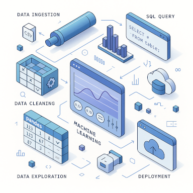

# **Comment peut-on s’assurer que les modèles d’apprentissage automatique respectent les principes éthiques et de non-discrimination ?**
1. **L’équité et la non-discrimination**  
   Il est essentiel de veiller à ce que les données utilisées pour entraîner les modèles d’IA soient représentatives et exemptes de biais, afin d’éviter que les algorithmes ne perpétuent des préjugés ou des inégalités injustes.  
   Des techniques de correction des biais peuvent être appliquées pour garantir l’équité des décisions prises par l’IA.
2. **La transparence et l’explicabilité**  
   Les processus de décision des modèles d’IA doivent être transparents et compréhensibles, afin que les utilisateurs puissent comprendre comment ces systèmes fonctionnent et prennent leurs décisions.  
   Afin de s’assurer que les décisions sont justifiées et conformes aux principes éthiques.
3. **La responsabilité et la gouvernance**  
   Des mécanismes de gouvernance et de responsabilité doivent être mis en place, avec des comités d’éthique chargés d’évaluer et de surveiller l’utilisation de l’IA.  
   Afin de s’assurer que les applications d’IA respectent les normes éthiques établies.
4. **Protection de la vie privée et sécurité des données**  
   Les données utilisées pour entraîner les modèles d’IA doivent être gérées de manière sécurisée et dans le respect de la vie privée des individus.  
   Des politiques et des protocoles robustes de protection des données doivent être mis en place.
5. **L’implication des parties prenantes**  
   Il est important d’impliquer les différentes parties prenantes, notamment les experts en éthique, les utilisateurs finaux et les groupes touchés, dans le développement et le déploiement des modèles d’IA, afin de s’assurer que leurs préoccupations et leurs besoins sont pris en compte.

<!-- **⟹ En adoptant ces mesures, on peut s’assurer que les modèles d’apprentissage automatique respectent les principes éthiques et de non-discrimination, tout en favorisant une IA responsable et bénéfique pour la société.** -->