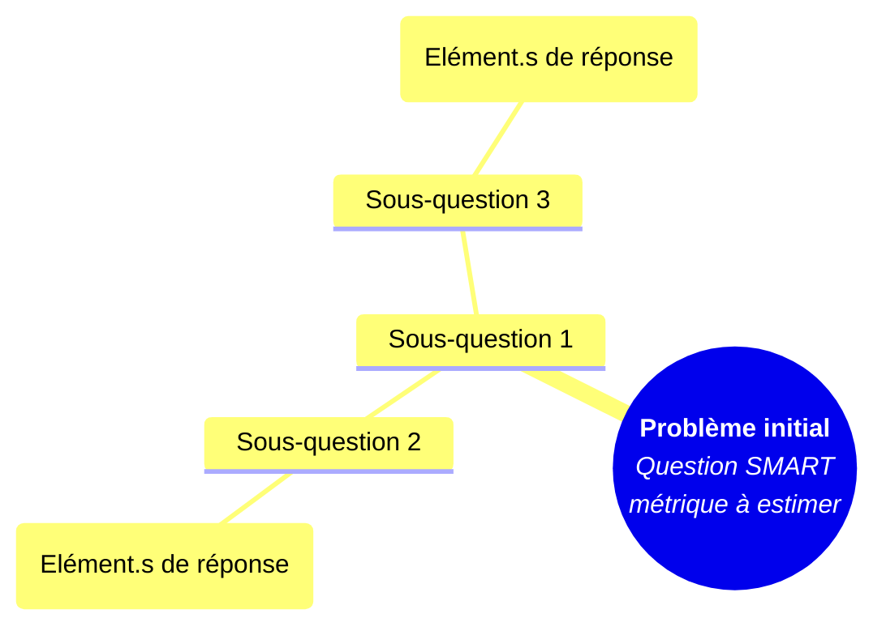
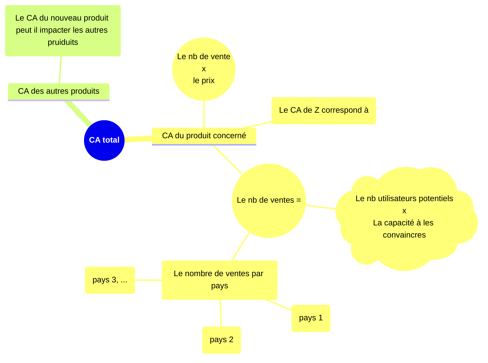

# Adapter la modélisation pour estimer l’impact d’un nouveau produit

Quel est la croissance du CA espérable dans les trois mois après le lancement du produit ?  
Un arbre est dessiner, sauf que les branches correspondent aux sous-éléments de la métrique à estimer.  

Uen fois obtenu les sous-éléments que l’on peut estimer, on s’arrête et remonte la métrique principale en faisant les opération identifiées