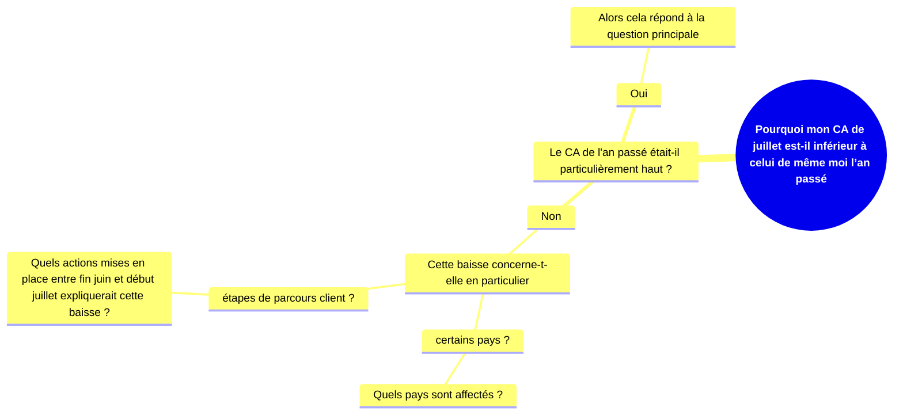

# L’arbre décisionnel

Soit à chaque niveau la réponse oriente vers une branche de l’arbre en particulier pour continuer l’analyse, soit elle apposte des éléments permettant de solutionner la question principale. Une fois les sous-questions complètements développées. La réponse à la question principale est apportée. Et on peut creusé la recherche pour savoir ce qui a changé à propos de ces pays.

Pour s’assurer de la pertinance des branches, le mieux et plus simple est de résumer en une phrase comment elle pourrait apporter des infos à propos du pb principal. E.g. Si seule la Fce est affectif, il faut en déduire que la cause impact spécifiquement la Fce.

Le but n’est pas de produire un arbre complet, avec tous les pb possible au pb initial. Les sous-questions sont interdépendantes, et souvent la réponse à l’une répond à d’aures, les rendant obsolètes. Si l’on sait que le pb à lieu après l’arrivée au site, inutile de faire une ségmentation par canal d’acquisition. Donc, au lieu de réfléchir longuemetnt à différentes hypothèses, il faut construire l’arbre par petits bouts. Alors, poser trois ou quatre sous-questions et y répondre, puis revenir à l’abre ayant donner des résultats et dérouler et développer encore trois ou quatre sous questions de plus depuis ces résultats. 

#### Pourquoi, pas une seule ?
Généralement, on explore simultanément plusieurs voies tant que chacune amène à une direction différente.  
Cela permet de raisonné avec plus de cohérance que point à point.  

Cette façon force à revenir à l’arbre global, donc à la quesion initiale.