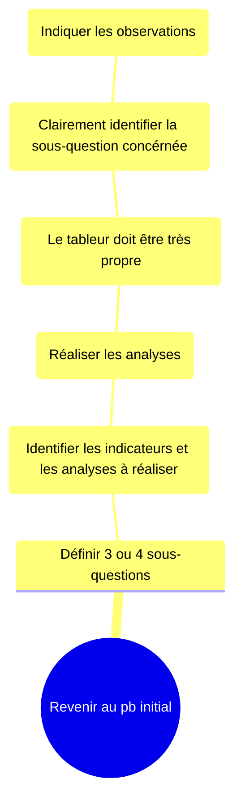

# Répondre aux sous question
À chaque sous-question, il faut chercher les indicateurs pertinants à collecter.  
Généralement, pour les sous-questions au parcours client, un seul indicateur est retenu par sous-question, puis uen ou deux analyses maxi, en distinguant l’anlyse principale et l’analyse secondaire (afin de contrôler le biais) ; l’intérêt étant d’obtenir une réponse claire.  
Le fait de multiplier les analyses pour une même sous-question, et un risque d’analyses des éléments ne répondants pas à la question initiale. E.g. Si le CA baisse de 15%, il faut observer les pays afin de voir lequel est le plus à la baisse.  

Pour constater une baisse ou que leur deux variables sont, ; leur courbes évoluants ensemble, il y a deux manières.  
## L’approche des néopytes
Observer généraleeent la courbe ou un tableau agrégeant les données. Afin de constater des différences ou tendances. 
## L’approche du statisticien
Et plus complexe ; sachant qu’à tout moment, de nombreux éléments de contexte influencent les variables obervée, qu’en permanence une courbe oscile et que deux variables peuvent avoir la même évolution par hasard.  
Ces méthodes lui permettront d’observer si les mouvements sont bien significatifs (le chiffre plus bas que les variations quotidienne ou si les variables sont bien corrélées).

Ces méthodes statisticiennes nécéssitent un très grand volume de données et des calcuels plus commplexes que ceux d’uun simple fichier de tableur. 

Dans ce cas, il ne faut chercher la rigueure d’un statisticien. 
* La vitesse : le problème est urgent ;
* La faisabilité : le volume de données est généraleemnt limité (il faut généralement plusieurs centaines d’utilisateurs pour obtenir un résultats) ;
* L’objectif : le but est d’agir, pas comprendre.

Ce pb peut être solutionner en connaissant globalement la cause de la basse.  
Et si la baisse était un effet hasardeux ou que la cause identifiée n’est pas tout à faàt la bonne, ce n’est pas important ; les actins en place ont généraleemnt un effet asser large, permettant une marge d’erreur.
## Traiter les besoins

Ces consignees permettent de revir à l’analyse ultérieuremet, surtout au moment de rédiger l’interprétation finale de de la modélisation.  
Puis, revenir à l’arre et trouver comment ces nouvelles questions permettent d’avancer, quelle.s nouvelle.s faut-il poser.  
Lors de la segmentations d’un problème en sous-éléments (ségmentation de volume du parcours client, sous éléments d’un indicateur), il faut se concentrer sur ce qui explique une partie majeure de la baisse.  
À chaque retour à l’arbre, il faut ce demander s’il y a asser d’éléments pour agir, sinon ne rien faire. Il est toujours possible d’approfondir, c’est à soit de juger quand s’arrêter et décider de passer plus de temps à faire une action meixu ciblée ou mettre en place plus rapidement une action moins aboutie.