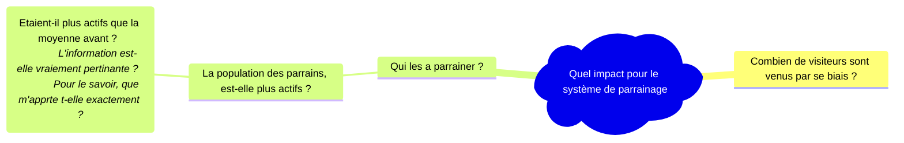
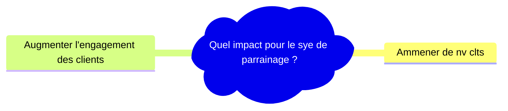

# Revenir au problème
L’analyse consiste souvant à aborder un problème assez large, il est facile d’être perdu dans des ramifications, des pistes, … Revenir au problème permet une meilleure gestion du temps
* En se focalisant aux éléments d’analyse ayant le plus d’impact à la conclusion finale ;
* identifier s’il l’on faut fausse route, ou que les infos rechrchés sont hors sujet ;
* Sortir d’une impase en dientifiant les champs d’analyse qui restent à exlorer ;

## Mieux géer son tmeps

À la question

L’impact est double. Le deuxième aspect est probablement moins important que le premier, c’est plus un effet secondaire de l’action qu’un objectif ; il y a bcp d’autres façons de l’augemnter plus efficacement et moins complexe.
* Programme de fidélité ;
* Les infolettres ;
* Les promotions, …

En revenant au problème permet de voir qu’approfondir dans la direction n’a qu’un petit impact à la conclusion finale. L’impact principal est donc, “Combien de nouveau visiteurs par ce biais”.  

On peut notament finir analyser des phénomènes en dehors de la période considérée.  
Pour connaître l’impact d’une nouvelle action, il faut commencer par identifier la valeur de comparaison (ex : les semaines passées). Si le nb de ventes à fluctuer avec importances quelques temps avant l’introduction de l’action, puis s’est stabilisée, cela peut tenté de savoir pourquoi. Hors cela ne donne pas d’éléments sur l’efficacité de l’action. Si la fluctuation ne s’est pas réitérée, le postulat qu’elle n’affectera pas l’action est envisageable.  

Il peut arriver d’analyser des indicateur ayant très peu d’influence au problème initial (en regardant la TVA par pays au lieu du nb de ventes). Cela ne la rend pas pertinente pour l’entreprise, mais ça permet de prioriser convenablement par rapport aux autres tâches en cours.

## Sortir dune impasse
Il peut arriver de ne pas savoir quoi conclure des résultats obtenus et commment avancer.  
Revenir permet de quitter cette impasse, aidant à l’interprétation des résultats et en replaçant dans un contexte plus global les résultats.  
Cette vision holistique du pb permet de voir si les résultats forment l’extrémité de la branche de réflexion à laquelle on se situait et s’il est utile d’approfondir.  
On peut aussi réaliser d’avoir tous les éléments pour répondre au problème initial et conclure.