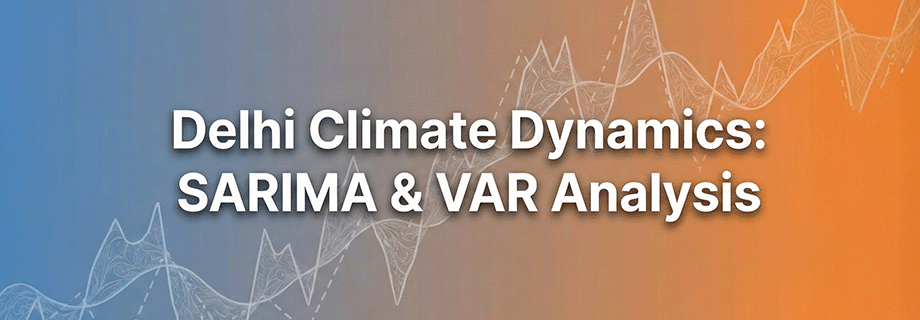
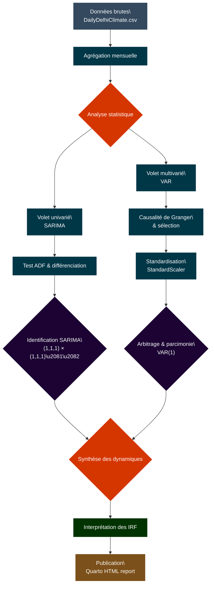

# **Analyse des dynamiques climatiques de Delhi**

Étude des séries temporelles climatiques de la ville de Delhi.  
Modéliser et de comprendre les interactions dynamiques entre la température, l'humidité et la vitesse du vent par une approche économétrique.
---

 
 
 
 
 

## **L'objectifs du Projet**
L'étude s'articule autour de deux axes :
1. La **modélisation Univariée (SARIMA)**  
   ➜ Capture de la composante saisonnière annuelle et prévision de la température moyenne.
2. L'**analyse Systémique (VAR)**  
   ➜ Étude des rétroactions entre variables climatiques après vérification de l'antériorité informative (Causalité de Granger).
## **La méthodologie**
* Le **prétraitement**  
  ➜ Agrégation mensuelle des données journalières pour extraire le signal climatique.
* La **stationnarisation**  
  ➜ Utilisation du test de Dickey-Fuller Augmenté (ADF) et application de différenciations saisonnières.
* La **sélection de Modèle**  
  ➜ Arbitrage entre complexité et fidélité via le principe de **parcimonie** (Critère AIC).
* M'**interprétation**  
  ➜ Analyse des fonctions de réponse impulsionnelle (**IRF**) sur données standardisées.
## **Les principaux Résultats**
* Mise en évidence d'une **stabilité systémique** ➜ le retour à l'équilibre après un choc climatique s'opère sous 6 à 8 mois.
* Validation d'une **causalité au sens de Granger** de l'humidité sur la température, confirmant l'interdépendance des variables atmosphériques.
* Modèle final retenu ➜ **VAR(1)** pour sa robustesse statistique.
## **Le Workflow de l'Étude**

___
_Projet d'analyse de série temporelle réalisé dans un cadre académique_.