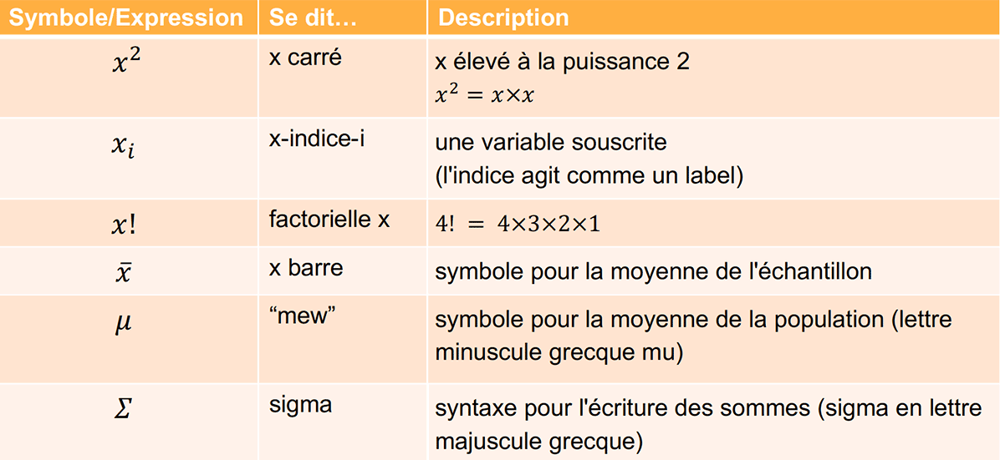

# **La mesure des données**
## **Les niveaux de mesure ou types de variable**
### Types de valeurs qualitatives ou catégorielles
#### **Variables nominales**
_[Décrit la catégorie d’industrie dont relève une entreprise]_
Il s’agit de catégories prédéterminées ayant un nom.  
Elles ne sont pas triables (e.g. la classification des animaux, les partis politiques, …).  
Le seul calcul réalisable sur les variables nominales est le nombre d’éléments par catégorie.
#### **Variables ordinales**
Elles sont triables du fait qu’elles sont ordonnées par nature ; elles désignes un rang.  
Elles ne peuvent pas être organisés par une échelle de valeur (e.g. les réponses à un sondages : souvent, parfois, rarement, jamais, …).  
Le tri est limité à l’ordre.
_Il n’y a pas d’échelle numérique aux variables ordinales, c’est la différence comparativement aux variables nominales._
### **Variables quantitatives (mesurables)**
#### **Les intervalles**
Fournissent une échelle de valeur.  
Analogues aux variables ordinales, mais l’intervalle entre deux catégories a toujours la même valeur, la même signification, mais lui manque un vrai point zéro (plancher). Les intervalles peuvent êtres négatifs.  
- 99 est 10% supérieur à 90.
- 20° n’est pas deux fois plus chaud que 10°.
- La différence entre 10 et 11 est = à celle entre 20 et 21.

Il faut privilégier les quantités continues mesurables comme des profits ou le temps, qui ont un plancher et sont comparables aux ratios ou rapports.
#### **Les ratios ou rapports**
_[Décrit le profit net ou la perte qu’une entreprose peut enregistrer dans l’année]_
Sont des variables d’intervalles ayant un plancher.  
Elles ne peuvent pas être négatives (e.g. poids, âges, salaire, distances) qui sont des valeurs de ratio et sont réellement situées sur une échelle de valeur.

Bien les connaitre permet de savoir le traitement statistique que l’on peut opérer et savoir les interprétées.
## **Différence entre la population et l’échantillon**
* La population représente tous les membres d’un groupe ; c’est un ensemble fini d’objets sur lesquels une étude se porte, dont les éléments répondent à une ou plusieurs caractéristiques communes.
* L’échantillon est un sous-ensemble de membres (population) mesurable par le temps et les ressources. Dans la plupart des cas, il ne peut pas être pris un point donné de chaque personne de la population.
## **Symboles et notions mathématiques de bases**
  
* Les exposants sont le nombre de fois où il faut multiplier `3^4 = 3*x*3*3*3 = 81`,  
  Si l’exposant est négatif, c’est la réciproque de cet exposant `x^-3 = 1 / x*x*x`,  
  `x(1/n) = n racine de x ` donc `8(1/3) = 3 racine de 8 = 2` car `3*2*2 = 8`.
* Les factorielles, le nombre réel `x` et le multiplier par `x-1` puis `x-2` … jusqu’à `1`  
  `x! = (x-1) * (x-2)*...*1`  
  `6! = 6*5*4*3*2*1 = 720`et le résultat est `720`  
  Il se divise ensemble `(5!/3!) = (5*4*3*2*1/3*2*1) = 5 * 4 = 20`, les factorielles identiques s’annulent, c’est très courant.
* Les sommes simples  
  Il faut additionner jusqu’à la valeur n  
  Si x^2 en pensant au 4 de la somme, 
* Les sommes ete séries [x représente chcun des termes d’une série]  
  Le i en bas de sigmaest un indice qui varie de 1 à n, le but et d’additioner chaque élément de x indice i en remplaçant toutes les valeurs que prend i. x indice 1 + x indice 2 … jusqu’à x indice n.
* Les équations  
```
"x barre (symbole de la moyenne d'un échantillon) est égal à la somme (indiquée par la letttre grecque sigma) de tous les valeurs x-indice-i dans la série x avec i allant de 1 au nombre n d'élément dans la série divisée par n."
```
Il faut prndre chaque valeur de l’ensemble, les additionner, puis les diviser par n ou le nombre total d’éélments de l’ensemble.
1. Les séries de valeurs  
   {7 8 9 10}
2. Attribuer des posiition (indice) à chaque élément  
    {7 8 9 10} donc 1 2 3 4 donc n=4
3. Il deviennet  
   x-indice-1, x-indice-2, …