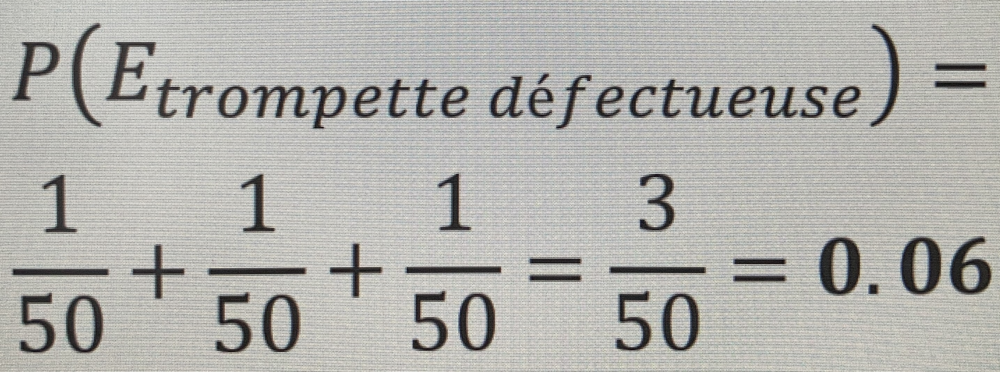

# **Régles d’additions et de multiplication**
## **La règle d’addition**
La proba qu’A se _ou_ que B se produise est égale à la proba d’A plus celle de B, moins celle d’A et B.
```js
P(A ∪ B) = P(A) + P(B) - P(A ∩ B)
```
Donc additionner les deux cercles du diagramme logique (de Venn) et défalquer la partie se chevauchant.
```js
P(A ∪ B) = 48 / 100  - 62 / 100
         = .48 = .62 - .16
         = .94 // en remplaçan les proba
```
## **La règle d’addition pour les évènements qui _mutuellement exclusifs_**
Lorsque 2 évènements ne peuvent pas se produire tous les 2, on les dits _`mutuellement exclusifs`_.

Si dans le diagrammme de Venn, les cercle ne se chevauchent pas dans la globalité de l’échantillon.  
Au progamme de santé, 32 employés en prix le plan A et 56 le plan B.  
Ici, il faut choisir l’un ou l’autre ; les évènements s’éxcluent mutuellement.
```js
P(A ∪ B) = P(A) + P(B) // le terme de proba d'intersection, car elle n'exista pas pour les évènements mutuelleemnts exclusifs
```
### Exercice
Quelle est la proba qu’une trompette est 3 valves déféctueuses ?  
1 valve défectueuse ne peut pas occuper 2 places à la même trompette  
<a href="#"><div align="center"></div></a>

## **La rèlge des multiplucations**
La proba qu’AB se produise est égale à celle d’A multiplier par celle de B sachant qu’A est connu.
```js
P(A ∩ B) = P(A) · P(B|A)
```
### Exercice
Avec un jeu de 52 cartes, quelle est la proba de tirer 4 as ?
```js
P(A ∩ B ∩ C ∩ D) = P(A) · P(B|A) · P(C|AB) · P(D|ABC)
```
P d’A inter B, inter C, inter D est égal à la proba d’A multiplier par celle de B sachant A fois, celle de C sachant AB, fois celle de D sachant ABC.
```js
P(A ∩ B ∩ C ∩ D) = 4/52 x 3/51 x 2/50 x 1/49 = 24/6 497 400 = 1/270 725
```