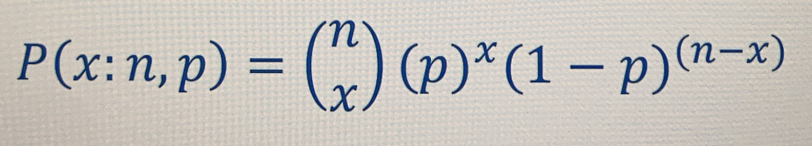
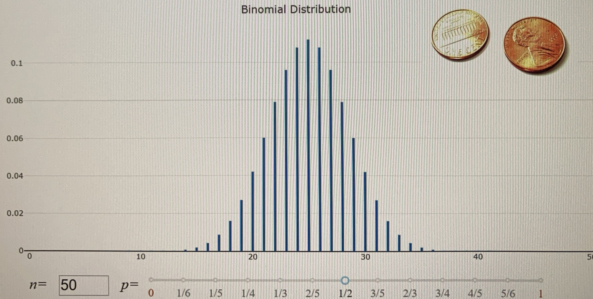
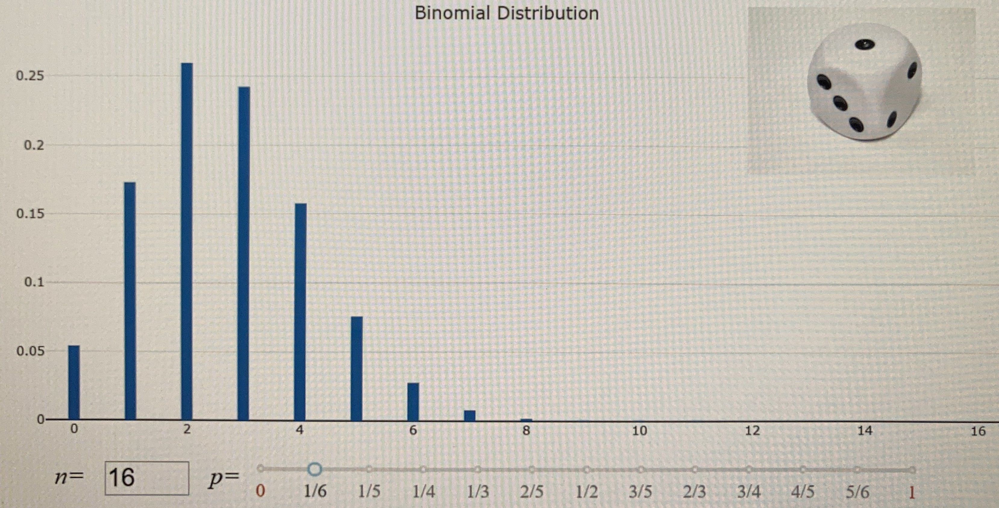
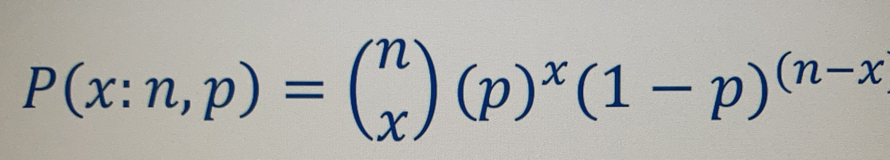
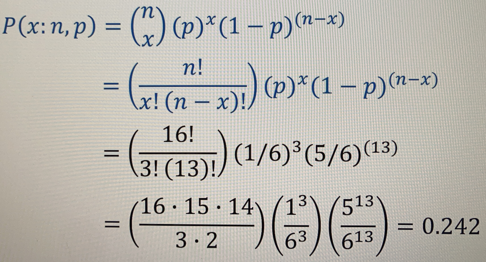

# **Distribution binomiale** <a href="../"></a>
## **Distribution binomiale discrète**
**Binomiale**signifie qu’il y a 2 résultats distincts et mutuellement exlusifs d’une épreuve.  
Cela pourrait être 
* pile/face
* marche/arrêt
* santé/maladie
* réussite/èchec
## **Épreuves de Bernoulli**
Il s’agit d’une expérience aléatoire où le résultat peut être le succés ou l’échec.

Dans une série d’épreuve _`n`_ suivra une distribution binaire tant que  
a) La probabilité de succès _`p`_ est constante (si l’objet est équilibré) ;  
b) Les épreuves sont indépendantes les unes des autres.
### **Fonction de masse de la Probabilité Binomiale**
Donne la proba d’observer _x_ succès dans _n_ épreuves.  
La proba de réussite d’une seule épreuve est désignée par _p_.  
Suppose que _p_ est fixé pour toutes les épreuves
<a href="#"><div align="center"></div></a>
_n_ = 10 lancés de pièces
_x_ = 3 faces
_p_ = .5 car, c’est la proba de réussite d’une seule épreuve. Et supposons que _p_ es fixe pour chaque épreuve.

L’axe ‘Y’ est la probabilité.  
L’axe ‘X’ est le nombre de succès.  
Plus il y a d’essai, plus l’axe ‘Y’ sera réduit.

Avec ‘pile’ ou ‘face’.
<a href="#"><div align="center"></div></a>
La proba est de .5 et que l’on peut jouer avec un nombre _n_ d’épreuve et obtenir la distribution du nobre de réussites suceptible d’obtenir.

Avec un dé équilibré à 6 faces.  
Il faut qualifier une face étant un succès, par conséquent les autres un échec.
<a href="#"><div align="center"></div></a>

### Exercice
En lançant le dé 16 fois, quelle est la proba qu’un 5 aparaisse 3 fois ?  
D’aprés le graphique, légèrement inférieur à .25

_x_ = 3 car c’est le nombre de succès voullu ;
_n_ = 16 car c’est le nobre de lancé ;
_p_ = 1/6 car c’est la proba d’obtenir un 5.

<a href="#"><div align="center"></div></a>
```js
x:n = x et n
```
<a href="#"><div align="center"></div></a>
Le résultat des .242 donc pas .25, généralement c’est fait avec Excel
```xls
=BINOME.DIST(3,16,1/6,FALSE)
```
la réponse est 0.24231760337131

Ou le langage Python.
```py
from scipy.stats import binom
binom.pmf(3,6,1/6)
0.24231760337131251
```
Des sites web pour exécutent ce genre de calcul.