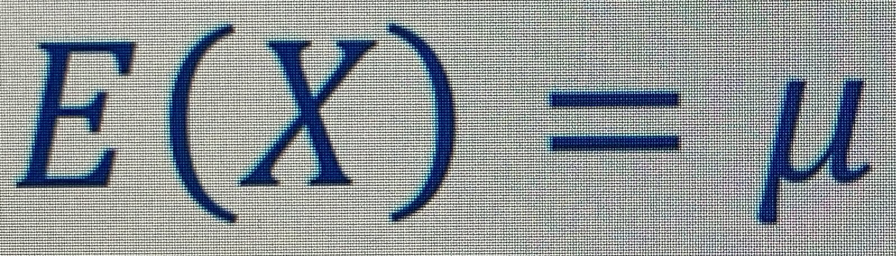
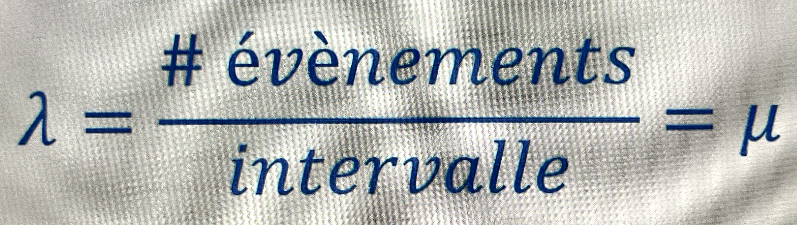
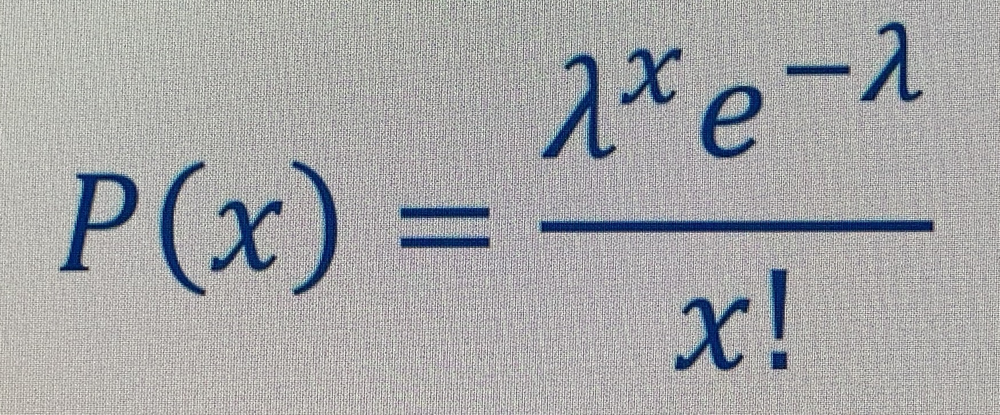

# **Distribution de Poisson (loi de Poisson)** 
La _**distribution de Poisson**_ _considère le nombre de succès par unité continue_ (e.g. l’unité de temps, la distance, etc) _au cours de nobreuuses unités_.

Le calcul de la fonction de masse de probabilité ou loi de probabilité de Poisson commence par une valeur moyenne attendue.
<a href="#">

</a>
Puis, celui-ci est affécté à lambda.
<a href="#">

</a>
La distribution de poisson permet d’avoir quelque chose après la virgule, car il s’agit d’unité continue.

En résumé, il s’agit d’un nombre de succès par unité continue.
<a href="#">

</a>
où `e = le nombre d'Euler = 2.71828...`, c’est un nombre irrationnel très célèbre, bcp utilisé en maths.