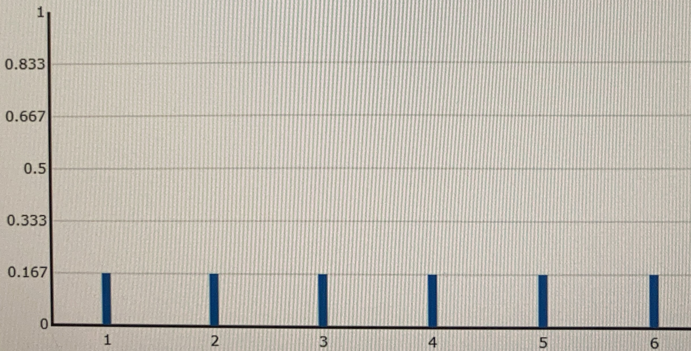

# **Distributions uniformes** 
## **Distgribution discrète uniforme**
Le lancé d’un dé équilibré à 6 faces à 6 résultats discrets qui sont même probabilités.  
On peut obtenir 1, 2, … mais pas 1,5.  
➨ Les distributions discrètes n’ont que certaines valeurs probables.  
Les probabilités de chaque résultats sont réparties uniforméments sur l’espace d’échantillon ou univers.
<a href="#">

</a>
N’ayant que les possibilités 1, 2, … 6 et pas 1,5… Elle est discrète.
Chaque proba à .167 possibiités de se produire car il est équilibré `1 / 6 = .167`. cela le rend uniforme. Le résultat de l’addition de toutes les hauteurzs identiques est 1.