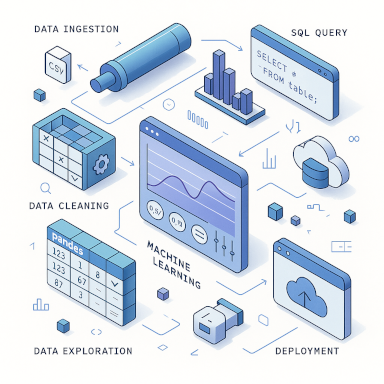

# Data Science 
# **Projets**
[Analyse des données de Netflix](Anaconda/netflix)  
[Analyse des données des universités américaines](Anaconda/usUniversities)
___

## **📊 Data Science et Statistiques**
[Probailité et Statistiques pour la Data Science et Business](productivityAndStatistics4DataScienceAndBusiness)
## [Python pour la Data Science](Anaconda) <a href="docs"><!--</a>-->
<!-- ## **Langage R** 
[Premier projet](R_language/OC/firstProject) -->

<h2>🔗 Disciplines connexes</h2>

🤖 [Intelligence artificielle](https://github.com/MiKL5/Artificial_Intelligence)  
🤖🧠 [Machine Learning](https://github.com/MiKL5/machineLearning)  
📊 [Business Intelligence](https://github.com/MiKL5/BI)